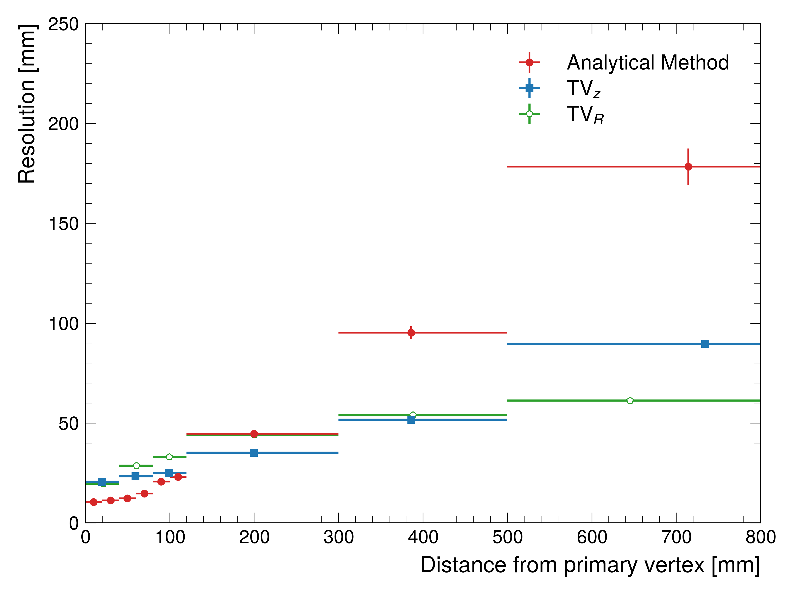

# Deep Neural Network (DNN) for vertexing particle-decay using calorimeter signals

DNN developed to localize the decay vertex of subatomic particles using signals from the ATLAS Liquid Argon (LAr) Calorimeter.

The LAr calorimeter at the ATLAS experiment measures the energy and time-of-flight of electromagnetic particles such as photons or electrons. Besides measuring the energy and time-of-flight, the segmented and projective geometry of the calorimeter enables the localization of the production vertex of the electromagnetic particles incident on the calorimeter. Therefore, the calorimeter can also be used as a "vertexing" detector to localize the decay vertex of subatomic particles decaying into electrons or photons.

Localizing the production vertex of subatomic particles using the calorimeter could enhance the search for exotic, long-lived particles (LLPs). These are particles which travel a certain distance within the ATLAS detector system before decaying into known subatomic particles such as photons or electrons. Such LLPs are predicted by several models beyond the Standard Model. One of first applications of the calorimeter as a vertexing detector was performed in the following [search](https://atlas.web.cern.ch/Atlas/GROUPS/PHYSICS/PAPERS/SUSY-2020-28/) for Supersymmetric (SUSY) particles. In this search, a SUSY particle decays into a pair of photons or electrons and its decay vertex is localized in two spatial dimensions. 

The motivation behind this DNN is to enhance the vertex-finding ability by improving the vertex resolution and also extending the vertex finding in three dimensions. The network is trained on simulated particle collision events containing a pair of photons or electrons producing from the decay of a long-lived SUSY particle. The input features for the network are a collection of low- and high-level variables derived from the calorimeter signals. 

The DNN consists of four hidden layers with 100, 100, 50, and 20 inputs with the architecture: shown [here](readme/model.png). 

The vertex resolution is greatly improved with the DNN as shown in the resolution. For vertex positions further away from the primary collision, the DNN localizes the SUSY particle decay vertex with a resolution of up to 90 mm compared to a resolution of 190 mm using the analytical method.
